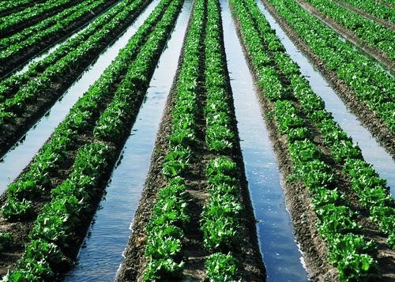

## Introduction

This document highlights a variety of agricultural and gardening techniques observed in various settings, focusing on methods that enhance water conservation, improve soil management, and optimize space utilization for cultivation. These practices are crucial for sustainable food production, especially in regions facing environmental challenges.

## Agricultural and Gardening Techniques

### 1. Sprinkler Irrigation

Sprinkler irrigation systems distribute water over crops in a manner that simulates rainfall. This method is commonly used for large agricultural areas, offering an efficient way to water diverse crops. While effective, careful management is required to minimize water loss due to evaporation and wind drift.

::: {layout-ncol="1"}
{fig-alt="Field being irrigated by a sprinkler system."}
:::

### 2. Sac Garden (Bag Garden)

Sac gardens, or bag gardens, involve growing crops in sacks or bags filled with soil. This technique is particularly beneficial in urban or peri-urban environments, or where traditional fertile land is scarce. It allows for vertical gardening, promotes efficient water and nutrient use, and can be adapted for small spaces.

::: {layout-ncol="1"}
{fig-alt="Woman tending to plants in a sac garden made of white bags."}
:::

### 3. Mulching with Organic Material (Leaves)

Mulching involves covering the soil around plants with a layer of organic material, such as leaves or straw. This practice is vital for retaining soil moisture by reducing evaporation, suppressing weed growth, regulating soil temperature, and enriching soil fertility as the organic matter decomposes over time.

::: {layout-ncol="1"}
{fig-alt="Rows of plants with the ground covered in dry leaves or straw mulch."}
:::

### 4. Stone Bunds / Filter Bunds

Stone bunds or filter bunds are structures built along the contours of slopes in agricultural land. Their primary purpose is to slow down water runoff, significantly reduce soil erosion, and enhance water infiltration into the soil. These are effective soil and water conservation measures, especially in hilly or semi-arid regions.

::: {layout-ncol="1"}
{fig-alt="Terraced agricultural land with stone bunds on a hillside."}
:::

### 5. Raised Beds

Raised garden beds are elevated plots of soil contained within a frame. They offer numerous advantages, including improved drainage, faster warming of the soil in spring, and easier access for planting and weeding. They also allow for better control over soil quality, as the soil within the bed can be custom-blended.

::: {layout-ncol="1"}
{fig-alt="Person raking soil in a raised garden bed."}
:::

### 6. Mandala Garden

A mandala garden is a circular garden design characterized by concentric or spiral patterns, often incorporating pathways. These gardens are not only aesthetically pleasing but also highly efficient for intensive planting and provide easy access to all parts of the garden. They can also create beneficial microclimates.

::: {layout-ncol="1"}
{fig-alt="Circular garden with plants arranged in a mandala pattern."}
:::

### 7. Furrow Irrigation

Furrow irrigation is a traditional method where water is channeled down narrow rows (furrows) between crop beds. The water then seeps sideways and downwards to irrigate the plant roots. This is a widely adopted irrigation technique, particularly suitable for row crops.

::: {layout-ncol="1"}
{fig-alt="Field with rows of green plants and water flowing in furrows between them."}
:::

### 8. Drip Irrigation

Drip irrigation is a highly efficient water delivery system that supplies water directly to the base of plants through a network of tubes and emitters. This method minimizes water loss from evaporation and runoff, making it ideal for water-scarce regions and promoting precise water application.

::: {layout-ncol="1"}
{fig-alt="Rows of young plants with drip irrigation lines running alongside them."}
:::

### 9. Plastic Mulching

Plastic mulching involves covering the soil with plastic sheeting, with plants growing through holes in the plastic. This technique helps to conserve soil moisture, warm the soil (beneficial for certain crops), and suppress weed growth. It is a common practice in modern commercial agriculture to enhance yield and quality.

::: {layout-ncol="1"}
{fig-alt="Field with rows of young plants growing through holes in silver plastic mulch."}
:::

### 10. Multi-Storey Garden (Vertical Garden)

A multi-storey garden, also known as a vertical garden or tower garden, maximizes growing space by stacking containers or planting units vertically. This innovative approach is excellent for urban farming, small households, or high-density commercial planting, often integrating efficient irrigation systems.

::: {layout-ncol="1"}
{fig-alt="Numerous multi-storey planting containers with plants growing, indicating a vertical garden setup."}
:::
